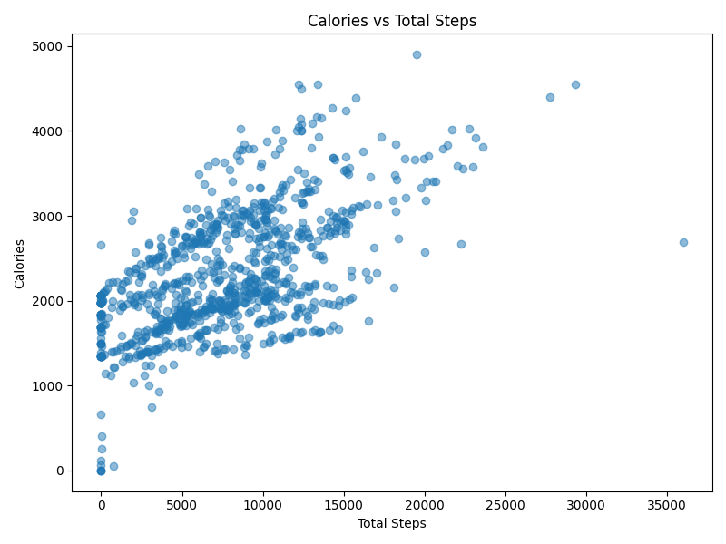

# 🏃‍♀️ Case Study 2: Bellabeat Wellness - Smart Steps to Wellness 📱

[](https://www.python.org/)
[](https://streamlit.io/)
[](LICENSE)

> **Tagline:** Smart Steps to Wellness: Decoding FitBit Data 🏃‍♀️

## 📖 Introduction

Did you know users sleep only **3 hours on average**? Explore this compelling analysis of Bellabeat's FitBit data to uncover correlations between activity, sleep, and health.

This case study analyzed FitBit fitness tracker data from 30 users over 31 days to gain insights into smart device usage and inform Bellabeat's marketing strategy. Using Python and pandas, I processed the data by unzipping the archive, merging daily activity, sleep, and weight datasets, cleaning dates, and calculating derived metrics like total active minutes and sleep hours.

## 🎯 Business Task

Analyze smart device usage data to gain insights into how consumers use non-Bellabeat smart devices, then apply these insights to one Bellabeat product to inform marketing strategy.

## 🛠️ Methodology

- **Data Sources:** FitBit data (Kaggle, 30 users, 31 days)
- **Tools:** Python, Pandas, Matplotlib, Seaborn, Streamlit
- **Steps:** Data merging, cleaning, correlation analysis, visualization

## 📊 Key Discoveries

| Metric | Average | Peak Day | Correlation |
|--------|---------|----------|-------------|
| Steps | 7,652 | Saturday (8,203) | Strong with active minutes (0.77) |
| Calories | 2,308 | - | - |
| Sleep Hours | 3.06 | Sunday (3.43) | Weak with activity (0.21) |

- Higher activity on weekends, more sleep on Sundays.
- Strong activity correlations, weak sleep-activity link.

## 📈 Visualizations




## 💡 Top Recommendations

1. **Activity Reminders:** Gentle notifications for low-activity days to boost engagement.
2. **Sleep Tracking Promotion:** Highlight sleep insights to encourage app usage.
3. **Personalized Campaigns:** Use correlations for tailored health marketing.

## 🚀 Interactive App

Interact with the data: [Streamlit App](https://your-streamlit-app-link.com) *(Host on Streamlit Cloud)*

## 📁 Repository Structure

```
case_study_2/
├── app.py                 # Streamlit web app
├── process_data.py        # Data processing
├── viz.py                 # Visualization generation
├── portfolio.md           # This file
├── data/
│   ├── mturkfitbit_export_*/  # Raw data
│   └── excel_copies/      # Processed data & images
└── requirements.txt       # Dependencies
```

## 🤝 Contributing

Open to contributions! Please fork and PR.

## 📞 Contact

- **Author:** [Your Name]
- **Email:** your.email@example.com
- **LinkedIn:** [Your LinkedIn]
- **Portfolio:** [Your Portfolio Site]

## 📄 License

Licensed under MIT License.

---

⭐ If this inspired you, star and share!

[](https://twitter.com/intent/tweet?text=Discover%20Wellness%20Insights%20from%20FitBit%20Data!&url=https://github.com/your-repo)
[](https://www.linkedin.com/sharing/share-offsite/?url=https://github.com/your-repo)
